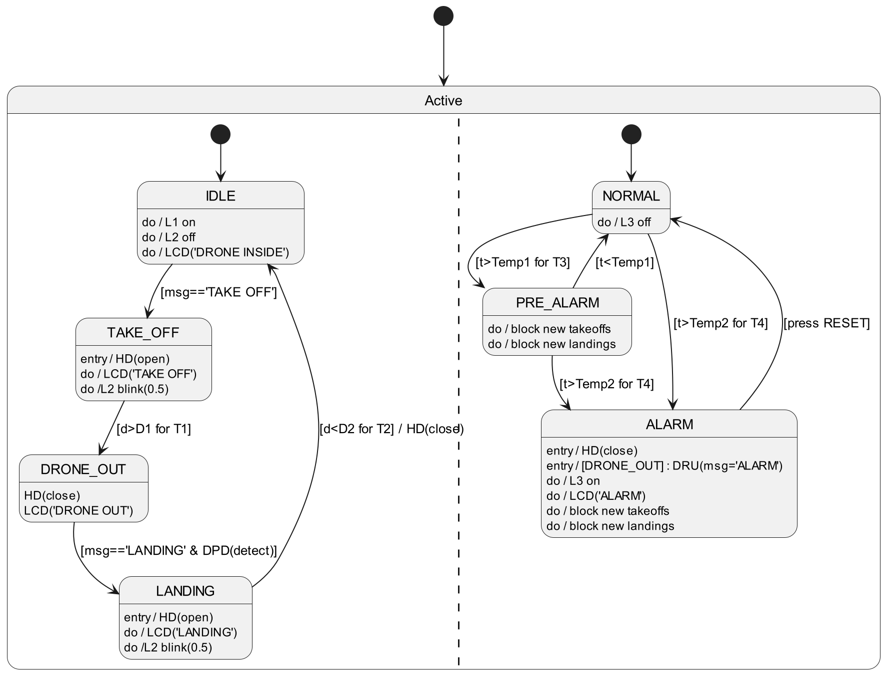

# Smart Drone Hangar - Project Report

**Course:** Embedded Systems and IoT - 2025/2026  
**Assignment:** #02 - Smart Drone Hangar  

## 1. Introduction
The goal of this project is to realize a "Smart Drone Hangar", an embedded system automating the storage, takeoff, and landing procedures of a drone. The system is composed of two main subsystems:
- **Drone Hangar**: An Arduino-based controller managing sensors (PIR, Sonar, Temperature), actuators (Servo motor, LEDs, LCD), and the system logic.
- **Drone Remote Unit (DRU)**: A Java-based PC application acting as a remote control dashboard and telemetry monitor.

## 2. System Architecture
The system follows a **Master-Slave** pattern over a Serial communication channel:
- The **DRU (PC)** sends high-level commands (`TAKE OFF`, `LANDING`).
- The **Hangar (Arduino)** executes the logic, controls the hardware, and reports status updates and telemetry data (`DIST`, `TEMP`, `ALARM`) back to the PC.

### 2.1 Arduino Software Design
The firmware is designed using a **Super-Loop architecture with Cooperative Multitasking**. 
A custom `Scheduler` manages the execution of several `Task` objects. This ensures modularity and non-blocking operations.

**Key Tasks:**
1.  **HangarControllerTask**: Implements the main Finite State Machine (FSM) of the hangar logic.
2.  **TemperatureMonitorTask**: Monitors environmental temperature and handles Alarm/Pre-Alarm states asynchronously from the main operational logic. It is also a FSM.
3.  **HangarDoorTask**: Manages the smooth movement of the servo motor.
4.  **MsgTask**: Handles serial communication (buffering and parsing).

### 2.2 Finite State Machine (FSM)
The core logic is implemented as a synchronous FSM within `HangarControllerTask`.

**States:**
- **IDLE**: Hangar closed, drone inside.
- **TAKE_OFF**: Hangar open, waiting for drone departure (Sonar check).
- **DRONE_OUT**: Hangar closed, drone is away.
- **LANDING**: Hangar open, waiting for drone arrival (PIR detection + Sonar check).
- **ALARMED**: System locked due to high temperature (triggered by `TemperatureMonitorTask`).

*(See `state_diagram.wsd` or `state_diagram.png` for the visual representation)*

## 3. Hardware Design
The system interacts with the physical world through the following mapping:

| Component | Pin | Description |
| :--- | :--- | :--- |
| **PIR Sensor** | D2 | Detects drone presence for landing requests. |
| **Servo Motor** | D6 | Opens/Closes the hangar door. |
| **Reset Button** | D7 | Manual reset for alarm state. |
| **Sonar (Echo/Trig)**| D8/D9 | Measures distance to confirm takeoff/landing. |
| **Green LED (L1)** | D11 | Indicates "Drone Inside" / Idle state. |
| **Green LED (L2)** | D12 | Blinks during active operations (Takeoff/Landing). |
| **Red LED (L3)** | D13 | Indicates Critical Alarm state. |
| **Temp Sensor** | A0 | Monitors internal temperature. |
| **LCD Display** | I2C | Shows system status messages to the operator. |

*(See `circuit.png` for the schematic view)*

## 4. Drone Remote Unit (Java)
The PC application is developed using **Java Swing** for the GUI and **JSSC** for serial communication. It features an event-driven architecture where incoming serial messages trigger UI updates on the Event Dispatch Thread (EDT).

**Features:**
- Real-time status visualization (Drone State, Hangar Status).
- Live telemetry for Temperature and Distance (during landing).
- Safety controls (Controls disabled during Alarms).

## 5. Usage
1.  Connect Arduino to USB.
2.  Launch the Java application (JAR or from IDE).
3.  Wait for "System Ready" log.
4.  Use **Takeoff** to open the hangar.
5.  Use **Land** to request re-entry (requires PIR activation on the breadboard).
